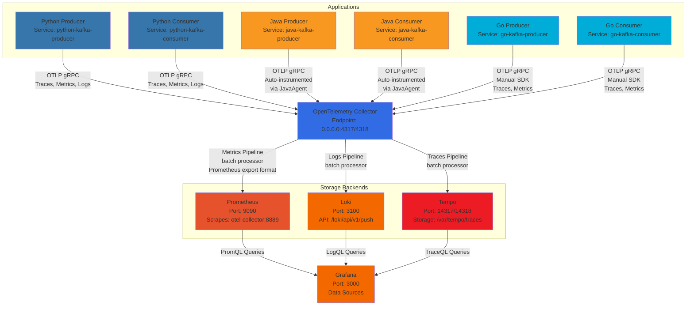

# Kafka Observability (O11y) Tutorial with Multi-Language Examples

This project provides a hands-on tutorial for understanding and implementing observability in Apache Kafka based systems. It features producers and consumers in Java, Python, and Go, all integrated with OpenTelemetry for collecting metrics, logs, and traces. The collected telemetry data is visualized using a Grafana stack (Prometheus, Loki, Tempo).

## Features

*   **Apache Kafka**: Core messaging system.
*   **Multi-Language Examples**:
    *   Java Producer & Consumer
    *   Python Producer & Consumer
    *   Go Producer & Consumer
*   **OpenTelemetry Integration**:
    *   Metrics: Collected from applications and Kafka clients.
    *   Logs: Enriched with trace context and sent to Loki.
    *   Traces: Distributed tracing across producers and consumers.
*   **Grafana Stack**:
    *   **Grafana**: For visualization and dashboards.
    *   **Prometheus**: For metrics storage and querying.
    *   **Loki**: For log aggregation and querying.
    *   **Tempo**: For distributed trace storage and visualization.
*   **OpenTelemetry Collector**: Centralized agent for collecting and processing telemetry data.
*   **Docker Compose**: Entire environment orchestrated with Docker Compose for easy setup.
*   **Streamlit Tutorial App**: A web-based guide to navigate the tutorial (content currently minimal).
*   **`start.sh` script**: For easy environment startup.
*   **Pre-configured Grafana Dashboard**: An overview dashboard (`Kafka O11y Tutorial Overview`) is automatically provisioned in Grafana.

## Project Structure

```
.
|-- docker-compose.yml         # Main Docker Compose configuration
|-- grafana/                   # Grafana configs and datasources
|-- loki/                      # Loki config
|-- prometheus/                # Prometheus config
|-- tempo/                     # Tempo config
|-- otel-collector-config.yaml # OpenTelemetry Collector config
|-- java-producer/             # Java Kafka Producer app & Dockerfile
|-- java-consumer/             # Java Kafka Consumer app & Dockerfile
|-- python-producer/           # Python Kafka Producer app & Dockerfile
|-- python-consumer/           # Python Kafka Consumer app & Dockerfile
|-- go-producer/               # Go Kafka Producer app & Dockerfile
|-- go-consumer/               # Go Kafka Consumer app & Dockerfile
|-- streamlit-app/             # Streamlit tutorial application & Dockerfile
|-- start.sh                   # Script to start/stop the environment
`-- README.md                  # This file
```

## Prerequisites

*   **Docker**: Ensure Docker engine is installed and running.
*   **Docker Compose (v2 syntax)**: Ensure you have `docker compose` command available (usually included with Docker Desktop or as a plugin for Docker Engine).

## Getting Started

1.  **Clone the Repository**:
    ```bash
    git clone <repository_url>
    cd kafka-o11y-tutorial
    ```
    *(Replace `<repository_url>` with the actual URL of this project)*

2.  **Start the Environment**:
    Run the `start.sh` script from the project root:
    ```bash
    ./start.sh
    ```
    This script will:
    *   Check for Docker and Docker Compose.
    *   Build the Docker images for the applications (if not already built or if Dockerfiles changed).
    *   Start all services in detached mode (`docker compose up --build -d`).
    *   Provide you with URLs for accessing the Streamlit tutorial and Grafana.

    The first time you run this, it might take a few minutes to download base Docker images and build the application images.

## Observability Data Flow Architecture

This section explains how telemetry data (logs, metrics, traces) flows from different language applications through the observability pipeline.

### System Architecture Overview



### Language-Specific Telemetry Implementation

#### 1. Python Applications (Manual SDK)
- **Configuration**: OpenTelemetry Python SDK with manual setup
- **Connection**: OTLP gRPC exporter to `otel-collector:4317`
- **Traces**: Manual span creation with Kafka message metadata
- **Metrics**: Custom counters and histograms (e.g., `python.producer.messages_sent`)
- **Logs**: Standard Python logging forwarded through OTEL Collector

#### 2. Java Applications (Auto-instrumentation)
- **Configuration**: OpenTelemetry Java Agent (v1.32.0) for automatic instrumentation
- **Connection**: OTLP gRPC exporter to `otel-collector:4317`
- **Traces**: Automatic span creation for Kafka operations and HTTP requests
- **Metrics**: Automatic JVM metrics, Kafka client metrics, and custom application metrics
- **Logs**: Logback OTEL appender for structured log forwarding

#### 3. Go Applications (Manual SDK)
- **Configuration**: OpenTelemetry Go SDK with manual setup
- **Connection**: OTLP gRPC exporter to `otel-collector:4317`
- **Traces**: Manual span creation with detailed Kafka operation attributes
- **Metrics**: Custom counters and histograms (e.g., `go.producer.messages_sent`)
- **Logs**: Standard Go log package (unstructured logging)

### OpenTelemetry Collector Processing Pipeline

The collector (`otel-collector-config.yaml`) processes telemetry data through three parallel pipelines:

**Traces Pipeline**:
```
Applications → OTLP Receiver → Batch Processor → OTLP Exporter → Tempo (port 14317)
```

**Metrics Pipeline**:
```
Applications → OTLP Receiver → Batch Processor → Prometheus Exporter (port 8889)
```

**Logs Pipeline**:
```
Applications → OTLP Receiver → Batch Processor → Loki Exporter (port 3100)
```

### Storage and Visualization Layer

- **Prometheus**: Scrapes metrics from collector endpoint (`otel-collector:8889`) and stores time-series data
- **Loki**: Receives logs via HTTP push API (`/loki/api/v1/push`) for log aggregation
- **Tempo**: Receives distributed traces via OTLP gRPC (`tempo:14317`) for trace storage
- **Grafana**: Queries all three backends using PromQL, LogQL, and TraceQL respectively

### Key Network Configuration
- **OTEL Collector**: Binds to `0.0.0.0:4317/4318` to accept connections from all containers
- **Tempo**: Uses ports `14317/14318` to avoid conflicts with OTEL Collector
- **Service Communication**: All services communicate through Docker Compose internal networking

## Using the Tutorial

Once the environment is running:

1.  **Access the Streamlit Tutorial App**:
    *   Open your web browser and go to: `http://localhost:8501`
    *   *(Note: The content of the Streamlit app is currently minimal and will be expanded in future updates. This README provides more comprehensive guidance for now.)*

2.  **Observe Producer & Consumer Logs**:
    The producer applications (Java, Python, Go) will automatically start sending messages to a Kafka topic named `tutorial-topic`. The corresponding consumer applications will listen to this topic. You can view their logs to see this in action:
    *   To view logs for all services: `docker compose logs -f`
    *   To view logs for a specific service (e.g., `java-producer`):
        ```bash
        docker compose logs -f java-producer
        docker compose logs -f java-consumer
        docker compose logs -f python-producer
        # ...and so on for other services
        ```
    *   Look for log messages indicating messages being sent and received, and potentially OpenTelemetry context information.

3.  **Explore Telemetry Data in Grafana**:
    *   Access Grafana: `http://localhost:3000`
    *   Default credentials: `admin` / `admin` (you may be prompted to change the password on first login).

    **0. Check the Pre-configured 'Kafka O11y Tutorial Overview' Dashboard**:
    *   In Grafana's left sidebar, navigate to "Dashboards".
    *   Look for and open the dashboard titled "Kafka O11y Tutorial Overview".
    *   This dashboard provides a quick glance at message rates for producers/consumers and other relevant metrics from the system.

    **b. Metrics (Prometheus Data Source)**:
    *   In Grafana, go to "Explore" or create/edit a Dashboard panel.
    *   Select the "Prometheus" data source.
    *   Example PromQL queries:
        *   `rate(otelcol_process_uptime[5m])` (OTel Collector's own uptime)
        *   `rate(python_producer_messages_sent_total[1m])` (Custom metric from Python producer)
        *   `rate(go_producer_messages_sent_total[1m])` (Custom metric from Go producer)
        *   `jvm_memory_used_bytes{area="heap", service_name="java-kafka-producer"}` (JVM metrics from Java apps via OTel agent)
        *   Explore other metrics related to Kafka clients (e.g., `kafka_producer_`, `kafka_consumer_`) which might be available depending on the instrumentation level.

    **c. Logs (Loki Data Source)**:
    *   In Grafana, go to "Explore".
    *   Select the "Loki" data source.
    *   Example LogQL queries:
        *   To see logs for a specific application: `{service_name="java-kafka-producer"}`
        *   To see logs from the OTel Collector: `{job="otel-collector"}` or `{instance=~"otel-collector.*"}` (actual labels might vary slightly based on collector config)
        *   Filter by trace ID: `{service_name="python-kafka-consumer"} | json | line_format "{{.message}}" | trace_id="<some_trace_id>"` (assuming logs are JSON formatted and contain trace_id)
    *   You should find logs enriched with `service_name`, `trace_id`, `span_id`, etc.

    **d. Traces (Tempo Data Source)**:
    *   In Grafana, go to "Explore".
    *   Select the "Tempo" data source.
    *   You can search for traces using a Trace ID (if you have one from a log).
    *   Alternatively, use the "Search" tab in the Tempo query editor:
        *   **Service Name**: e.g., `java-kafka-producer`, `python-kafka-consumer`, `go-producer`.
        *   **Span Name**: e.g., `send_java_kafka_message`, `tutorial-topic process` (from Kafka instrumentation), `send_python_kafka_message`.
    *   Select a trace to view its flame graph and span details. You should be able to see the end-to-end flow of messages, from the producer, through Kafka, to the consumer, even across different programming languages.

## Stopping the Environment

*   To stop all running services:
    ```bash
    docker compose down
    ```
*   This will stop and remove the containers. Data stored in Docker volumes (Grafana dashboards, Prometheus metrics, etc.) will persist unless the volumes are manually removed.

## Running Unit Tests

Unit tests have been added for each of the language-specific applications (Java, Python, Go). Due to the nature of these applications (many having their core logic within `main` methods or relying on external services like Kafka), many of the tests are placeholder structures or test utility functions. Comprehensive unit testing would require significant refactoring of the applications.

Here's how you can run the existing tests:

### Java

The Java producer and consumer use Maven and JUnit 5.
1.  Navigate to the specific application directory:
    ```bash
    cd java-producer
    # or
    cd java-consumer
    ```
2.  Run the tests using Maven:
    ```bash
    mvn test
    ```
    This will compile the test classes and run them. Placeholder tests should pass, indicating the testing framework is set up.

### Python

The Python producer and consumer use `pytest`.
1.  Ensure you have a Python environment with `pytest`, `pytest-mock`, and the application's dependencies (from `requirements.txt`) installed. The simplest way to achieve this is often within the Docker container after it's built, or by creating a local virtual environment.
2.  Navigate to the specific application directory:
    ```bash
    cd python-producer
    # or
    cd python-consumer
    ```
3.  Run pytest:
    ```bash
    pytest
    ```
    The tests primarily cover OTel setup and Kafka client instantiation (mocked).

    *Note*: Direct execution of `pip install` in some automated environments can be problematic due to file system limitations. Running tests within the Docker container (after building it with a stage that includes test dependencies) or a local virtual environment is recommended.

### Go

The Go producer and consumer use the standard `testing` package.
1.  Navigate to the specific application directory:
    ```bash
    cd go-producer
    # or
    cd go-consumer
    ```
2.  Ensure Go modules are tidy and downloaded (if not already by the build process):
    ```bash
    go mod tidy
    ```
3.  Run the tests:
    ```bash
    go test ./...
    ```
    The tests cover utility functions (like `getEnv`) and a basic, tolerant check of the OTel initialization logic. Full testing of Kafka interaction is complex due to CGO dependencies and would typically involve more involved integration tests or significant refactoring for mockability.

    *Note*: Some automated environments might experience issues resolving specific complex Go module dependencies (`otelkafka/v2` in this case). If `go test` fails due to module resolution, ensure your local Go environment or the Docker build process can correctly fetch all dependencies as defined in `go.mod` and `go.sum`.

### Streamlit Application

The Streamlit tutorial application also uses `pytest`.
1.  Ensure you have a Python environment with `pytest`, `pytest-mock`, and `streamlit` (from `streamlit-app/requirements.txt`) installed. This is typically best done within its Docker container or a local virtual environment.
2.  Navigate to the Streamlit application directory:
    ```bash
    cd streamlit-app
    ```
3.  Run pytest:
    ```bash
    pytest
    ```
    The tests primarily cover helper functions and the placeholder behavior of content loading logic. Full UI interaction testing is beyond the scope of these unit tests.

    *Note*: Similar to other Python applications, direct `pip install` of Streamlit and its numerous dependencies in some automated environments can hit file system limits. Running tests within the Docker container or a local virtual environment is the most reliable approach.

## Further Development & Refinements

*   **Populate Streamlit App Content Files**: The Streamlit application (`streamlit-app/app.py`) is structured to load content from markdown files in the `streamlit-app/content/` directory. These files currently contain placeholders and need to be populated with detailed tutorial text.
*   **Go Application Tracer/Meter Naming**: The tracer/meter names in the Go applications (`go-producer/main.go`, `go-consumer/main.go`) use a placeholder module path (`github.com/example/...`). This should be updated to the actual module path for better consistency if the project is forked or formally structured.
*   **Advanced Kafka Observability**: Explore adding JMX Exporter for deeper Kafka broker metrics if not already covered by OpenTelemetry's Kafka metrics.
*   **More Custom Grafana Dashboards**: While an overview dashboard is now provided, additional, more detailed dashboards could be created for specific components or use cases.

## Contributing

Contributions are welcome! Please feel free to fork the repository, make improvements, and submit pull requests.
